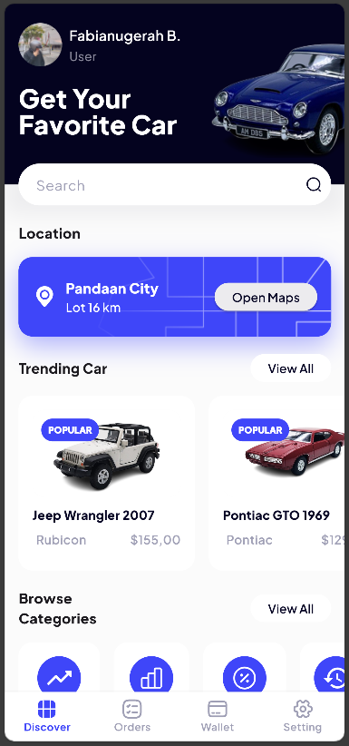

# 🚗 LuxeV Widget Showcase – Flutter UI Components

This project is a **Flutter UI design showcase** for **LuxeV**, a conceptual application for:
- 🚘 Car rental
- 🧸 Classic miniature car marketplace

It demonstrates **custom reusable widgets**, UI styling, and layout structure as a foundation for a future full-featured mobile application. The goal is to build high-quality, modular UI components that can be reused and extended into a production app.

---

## 🎯 Project Goals

- ✅ Practice building custom widgets in Flutter
- ✅ Create a consistent visual design system
- ✅ Prepare UI component architecture for future integration with backend/API
- ✅ Separate layout and logic for clean development

---

## ✨ Key Features

- 📱 **Reusable Car Cards** with:
  - Image preview
  - Car name
  - Rating
  - Price per day

- 🎨 **Modern UI Styling** using:
  - Rounded containers
  - Drop shadows
  - Responsive layout

- 🛠️ **Widget modularization**:
  - Code separation for widgets and screens
  - Easy to scale and maintain

- ⚡ Fast performance using stateless/stateful widgets

---

## 🛠️ Technologies Used

---

## 📷 UI Preview

